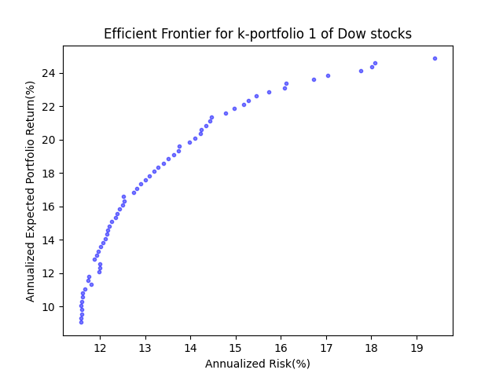

# 📈 Portfolio Optimization using Mean-Variance Analysis (Efficient Frontier)

This project showcases **Portfolio Optimization** using **Mean-Variance Optimization** — the foundation of **Modern Portfolio Theory** (MPT).  
The objective is to compute the **Efficient Frontier** for a selected portfolio of **Dow Jones Industrial Average (DJIA)** stocks using historical data from **April 2014 to April 2019**.

---

## 🚀 Key Highlights
- ✅ Implemented **Efficient Frontier** using **Python** and **Numerical Optimization**.
- ✅ Optimized portfolio weights for **maximum return** and **minimum risk**.
- ✅ Visualized **risk-return tradeoff** with Efficient Frontier plot.
- ✅ Annualized risk and return computed assuming **251 trading days/year**.
- ✅ End-to-end project — ready for practical investing or academic demonstrations.

---

## 📊 Dataset Used
- **DJIA_Apr112014_Apr112019_kpf1.csv**  
Contains historical stock prices for selected **Dow Jones** stocks from **April 2014** to **April 2019**.

---

## 🧮 Project Workflow
1. **Data Preprocessing**
   - Load and clean stock data.
   - Calculate **daily returns**.

2. **Portfolio Optimization**
   - Compute **covariance matrix** of returns.
   - Solve **constrained optimization** problems using `scipy.optimize`.
   - Identify optimal weights for:
     - **Minimum risk** portfolios.
     - **Maximum return** portfolios.
   - Generate **Efficient Frontier**.

3. **Risk & Return Calculation**
   - Calculate **annualized risk (volatility)**.
   - Calculate **annualized expected returns**.

4. **Visualization**
   - Plot the **Efficient Frontier** to visualize optimal risk-return trade-offs.

---

## 📈 Result — Efficient Frontier
The **Efficient Frontier plot** shows the trade-off between **annualized risk** and **annualized expected return**.  
Each point on the curve represents an **optimized portfolio** that provides the **best possible return** for a given level of risk.

---

✅ Constraints:
Sum of portfolio weights = 1 (Fully invested portfolio).
Target expected return achieved.

💡 Interpretation
The graph helps investors choose their preferred portfolio based on risk tolerance.
The left-most point is the Minimum Variance Portfolio (lowest possible risk).
The curve shows the best trade-offs — no portfolio exists that delivers higher returns for the same or lower risk.

🛠️ Tools & Libraries
Python
NumPy
SciPy
Matplotlib
Pandas

